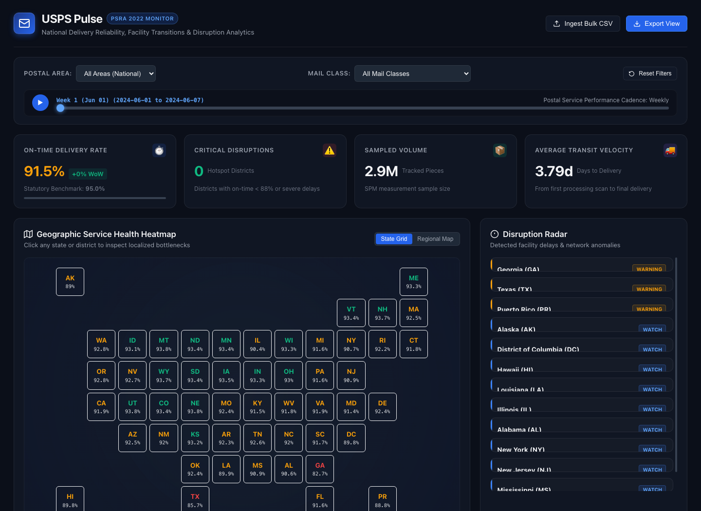

# USPS Pulse: National Delivery Health & Disruption Monitor

An interactive analytics web dashboard that monitors, analyzes, and visualizes U.S. Postal Service (USPS) delivery reliability, network health metrics, and acute operational disruptions across all 50 states and postal districts.



---

## 📌 Identified Public Data Sources

The application is architected around three authoritative federal data tiers:

1. **USPS Service Performance Measurement (PSRA 2022)**:
   * **Source:** [USPS Service Performance Dashboard](https://about.usps.com/what/performance/service-performance/)
   * **Cadence:** Weekly bulk CSV downloads (`Download Source Data` button).
   * **Metrics:** On-time delivery % across First-Class Mail (2-Day, 3–5 Day), Marketing Mail, Periodicals, and Package Services / Ground Advantage.
   * **Granularity:** National, Area (Atlantic, Central, Southern, WestPac), District, and 3-digit ZIP prefixes.

2. **Postal Regulatory Commission (PRC)**:
   * **Source:** [PRC Reports & eDockets](https://www.prc.gov/prc-reports)
   * **Metrics:** Statutory service benchmarks (90%–95% on-time target), Annual Compliance Reports (ACR), and Revenue, Pieces, and Weight (RPW) quarterly filings.

3. **HUD-USPS ZIP Code Crosswalk & Census Boundaries**:
   * **Source:** [HUD User Crosswalk Files](https://www.huduser.gov/portal/datasets/usps_crosswalk.html) & Census TIGER/Line.
   * **Metrics:** Allocation ratios mapping USPS ZIP codes and districts to Census tracts, counties, and state boundaries based on active delivery point counts.

---

## 🚀 Quickstart Guide

### Option 1: Using the Included Python Server (Recommended)
From this directory, run:
```bash
python3 serve.py
```
Open your browser and navigate to:
```
http://localhost:8080
```

### Option 2: Open Directly in Browser
Because the application is built with modern ES modules and zero external build steps, you can also open `index.html` directly or host it on any static web server (GitHub Pages, Netlify, Vercel, Nginx, or S3).

---

## 🌟 Core Features

* **Executive KPI Health Bar**:
  * Real-time composite on-time percentage vs. 95% statutory standard.
  * Week-over-week (WoW) velocity indicators (+/- delta).
  * Active hotspot disruption counter and total sampled mail volume.
* **Dual-Mode Geographic Visualizer**:
  * **State Tile Grid Cartogram:** 12x8 equal-area tile grid eliminating geographic scale bias so small northeastern postal districts (DC, RI, DE, NJ) are as visible as CA or TX.
  * **Regional Geographic Map:** Zone-based layout showing the 4 primary USPS Operational Areas (Atlantic, Central, Southern, WestPac) with interactive node positioning.
  * **Choropleth Color Scale:**
    * 🟢 **Healthy:** $\ge 93.0\%$ on-time.
    * 🟡 **Watch / Elevated Risk:** $88.0\% - 92.9\%$ on-time.
    * 🔴 **Critical Disruption:** $< 88.0\%$ on-time.
* **Disruption Radar & Incident Feed**:
  * Automated anomaly engine highlighting localized bottlenecks (e.g., Atlanta GA Palmetto RPDC consolidation, Houston TX processing modernization, winter storm freezes).
  * Click any incident card to immediately isolate and inspect that district on the map and charts.
* **12-Week Trajectory Scrubber & Player**:
  * Interactive scrubber slider with auto-play animation (▶) to watch delivery performance evolve across time.
* **Zero-Dependency SVG Charting Engine**:
  * 12-week trajectory line chart with national baseline and federal benchmark reference lines.
  * Multi-mail-class performance comparison matrix bar chart.
  * Top 5 vs Bottom 5 district benchmarks.
* **Live Bulk Data Ingestion Engine**:
  * Drag-and-drop CSV importer with built-in client-side RFC 4180 parsing.
  * Drop any bulk CSV downloaded from `about.usps.com` to visualize real live data instantly.
* **Data Export**:
  * Filter by Area, Mail Class, or State and click **"Export View"** to download the exact active subset as a CSV.

---

## 📂 Project Structure

```
usps-pulse/
├── index.html                   # Semantic HTML5 application shell
├── css/
│   └── styles.css               # Modern dark-mode design system & responsive layout
├── js/
│   ├── app.js                   # Application coordinator & state controller
│   ├── map.js                   # Interactive Tile Cartogram & Regional Map
│   ├── charts.js                # SVG Time-series & bar chart renderer
│   ├── anomaly_engine.js        # Disruption detection & alert feed
│   └── data_loader.js           # Sample data loader, CSV parser, and KPI rollups
├── data/
│   ├── postal_districts.json    # Postal district to state mappings and coordinates
│   ├── state_grid.json          # 12x8 Cartogram layout coordinates
│   ├── usps_psra_sample.json    # 12-week sample dataset (3,120 records)
│   ├── usps_psra_sample.csv     # Official PSRA-formatted bulk CSV export
│   ├── generate_data.py         # Sample data generation script
│   └── build_map_data.py        # Map layout build script
├── serve.py                     # Python HTTP server with proper MIME types
└── README.md                    # Project documentation & source guide
```
